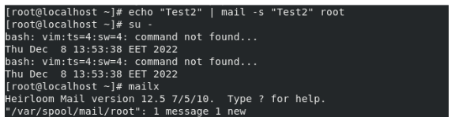

<!-- Output copied to clipboard! -->

<!-- You have some errors, warnings, or alerts. If you are using reckless mode, turn it off to see inline alerts.
* ERRORs: 0
* WARNINGs: 0
* ALERTS: 20 -->

**Lab 1**

**1 - systemctl status**

**2- **

**= > <code>systemctl set-default graphical.target</code></strong>

** **

**3 - 4**

**Echo “Test” | mail -s “Test” root**

**Su -s root**

**5 - **

** \
**

**6 - 7**

**8 - 9**

**13 -**

**lp -d tty12 /etc/hosts**

**lpstat tty12**

**14 -**

**cupsdisable tty12**

**15 -**

** lp -d tty12 /etc/hosts**

**Sudo lp -d tty12 /etc/xinetd.conf**

**16 -**

**lpq -a**

**lpq -P tty12**

**17 -**

**cancel tty12-2**

**cupsenable tty12**

**18 -**

**cupsreject tty12**

**19 -**

**lp -d tty12 /etc/hosts**

**lp: Destination "tty12" is not accepting jobs.**

**20 -**

**lpadmin -x tty12**

**// caneneled **

**21 - **

**crontab -e **

***/10 8-17 08 12 4**

**22 - **

**23 - **

**24 - **

