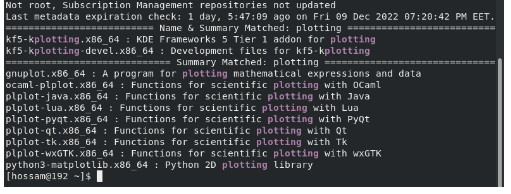

<!-- Output copied to clipboard! -->

<!-- You have some errors, warnings, or alerts. If you are using reckless mode, turn it off to see inline alerts.
* ERRORs: 0
* WARNINGs: 0
* ALERTS: 13 -->

**Lab 2**

20 -

gunplot

21 -

Yum search plotting

22 -

Yum info gunplot

23- sudo yum install gunplot

24 - tum remove gunplot

25 -

=> sudo yum remove gnuplot-common

3 packages

26 - rpm -qa

27 - rpm -ql initscripts

28 - rpm -ql bash

29 - rpm -aq –last pam

30 - rpm -qa | grep gnome

31 - rpm -U

