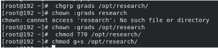

<!-- Output copied to clipboard! -->

<!-- You have some errors, warnings, or alerts. If you are using reckless mode, turn it off to see inline alerts.
* ERRORs: 0
* WARNINGs: 0
* ALERTS: 11 -->

**Lab 3** **part 1**

	 	 	 	

1. Display your MAC address by 2 different ways.

	 	 	 	

2. Display the network settings of all active interfaces.

3. Display the network setting of all interfaces both active inactive.

	 	 	 	

4. Bring your interface down.

**Lab 3 part 2**

** **

3 -

because the system will generate an incremental number not starting from 10000

9 - 

su - user2

touch /depts/sales/user2.txt

touch /depts/hr/user2.txt

touch /depts/web/user2.txt

10 - 

	

11 - 

Sudo umount /dev/boot

12 - 

Sudo mount /dev/boot

16 -

A-

B-

C-

D-

