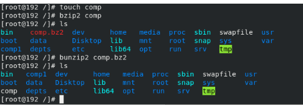
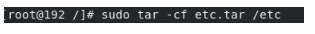
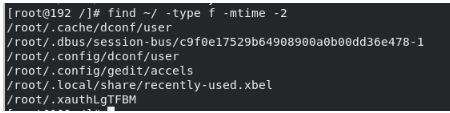
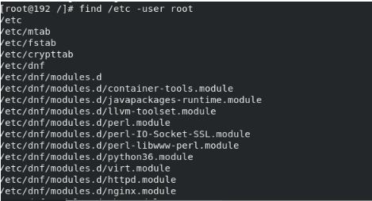
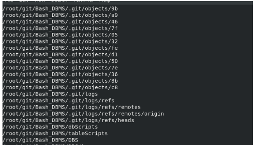
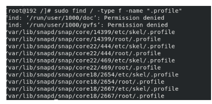
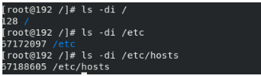
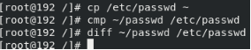

<!-- Output copied to clipboard! -->

<!-- You have some errors, warnings, or alerts. If you are using reckless mode, turn it off to see inline alerts.
* ERRORs: 0
* WARNINGs: 0
* ALERTS: 15 -->

Lab 4

1 -   fdisk -l

2 - 

3 - 

To make sure that the changes applied we have to reboot or use command 

Partprobe

Sudo cat /proc/partitions

4 - mkfs .

Mkfs.ext2 /dev/sdc1

5 -  sudo mkdir /data

6 -  ntfslabel /dev/sdcl data

7 - 

gedit /etc/fstab

LABEL=data /data ext4 defaults 0 0

8 - => mount /dev/sdc1 /data/

9 - 

10 - 

11 -

12 -

13 -

