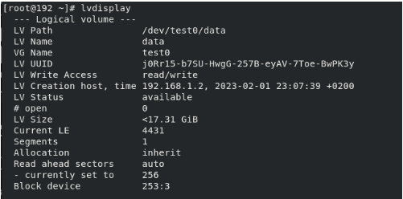
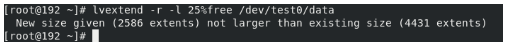
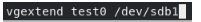

<!-- Output copied to clipboard! -->

<!-- You have some errors, warnings, or alerts. If you are using reckless mode, turn it off to see inline alerts.
* ERRORs: 0
* WARNINGs: 0
* ALERTS: 34 -->

**Lab 6 :**

1. **Find out what device node the /boot partition is **

   **df -h /boot**

1. **Estimate the size in bytes of a level-zero dump for /boot**

**=> sudo dump S /boot **

2. **Back up the data of /boot to a dump file in /var/tmp/dumpfile => Back up the data of /boot to a dump file in /var/tmp/dumpfile**
3. ** Look in the /etc/dumpdates file and see how the dump command recorded the timestamp of the full backup**

   **=> vi /etc/dumpdates**

4. **Use the restore command to view the contents of the dump file**

   **=> restore -if /var/tmp/dumpfile**

5. **Use restore command in the interactive mode to extract /grub/splash.xpm.gz and /grub/grub.conf**

** => restore -if /var/tmp/dumpfile /grub/splash.xpm.gz /grub/grub.conf**

    ** **

6. **Use the fdisk command to create 2 Linux LVM (0x8e) partitions using "unpartitioned" space on your hard disk. These partitions should all be the same size; to speed up the lab, do not make them larger than 300 MB each. Make sure to write the changes to disk by using the w command to exit the fdisk utility. Run the partprobe command after exiting the fdisk utility.**

** => sudo dump -u0 -f /var/tmp/dumpfile /boot **

    **8. Initialize your Linux LVM partitions as physical volumes with the pvcreate**

    **command. You can use the pvdisplay command to verify that the partitions have**

    **been initialized as physical volumes.**

    ** **

    **9. Using only one of your physical volumes, create a volume group called test0. Use**

    **the vgdisplay command to verify that the volume group was created.**

    **10. Create a small logical volume (LV) called data that uses about 30 percent of the**

    **available space of the test0 volume group. Look for VG Size and Free PE/Size in**

    **the output of the vgdisplay command to assist you with this. Use the lvdisplay**

    **command to verify your work.**

    **11. Create an ext2 filesystem on your new LV.**

    **12. Make a new directory called /data and then mount the new LV under the /data**

    **directory. Create a "large file" in this volume.**

    **Edit in fstap file**

    **13.**

    **14. - **

    **df -hT**

    **15.**

    **16.**

    **17.**

    **	**

    **18.**

    **19.**

    **20.**

    **21. **

    **22. **

    **23. **

    **gedit /etc/fstab**

